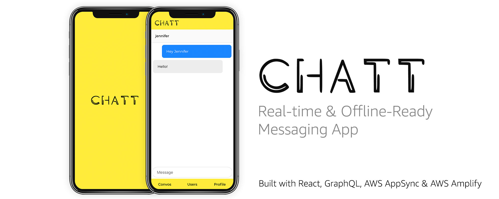
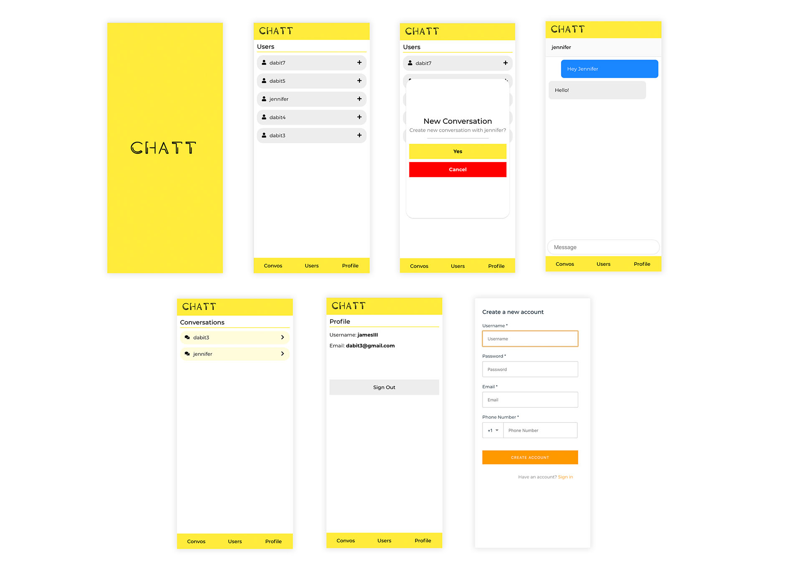

## Chatt

Real-Time Offline Ready Chat App written with GraphQL, AWS AppSync, & AWS Amplify

## Features

- User management
- Routing (React Router)
- Real-time
- Offline ready (conflict resolution handled for you when user comes back online)

## Technologies

- AWS AppSync
- AWS Amplify
- GraphQL
- MobX
- React Router
- React Apollo
- Glamor

## Screens



## Building the App

1. Make sure you are on the newest version of the AWS Amplify CLI

```sh
npm install -g @aws-amplify/cli@multienv
```

2. Clone Chatt

```sh
git clone https://github.com/aws-samples/aws-appsync-chat.git
```

3. Install dependencies

```sh
npm install
```

4. Initialize the amplify project

```sh
amplify init
```

5. Push the new resources to the cloud

```sh
amplify push
```

6. Run the project

```sh
npm start
```

## About

### Schema

This application utilizes 4 database tables:

- User table (stores user's identity information)
- Conversation table (stores conversations)
- Messages table (stores messages)
- ConvoLinkTable (stores relations between conversations & users)

## License

This library is licensed under the Apache 2.0 License. 
